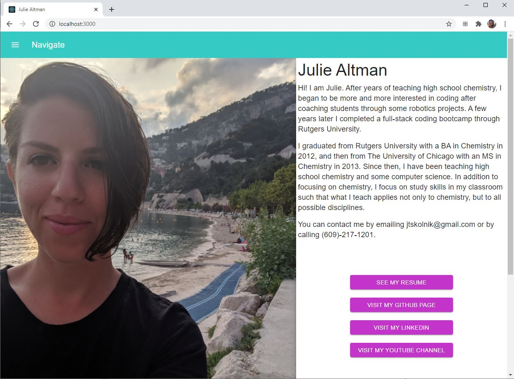
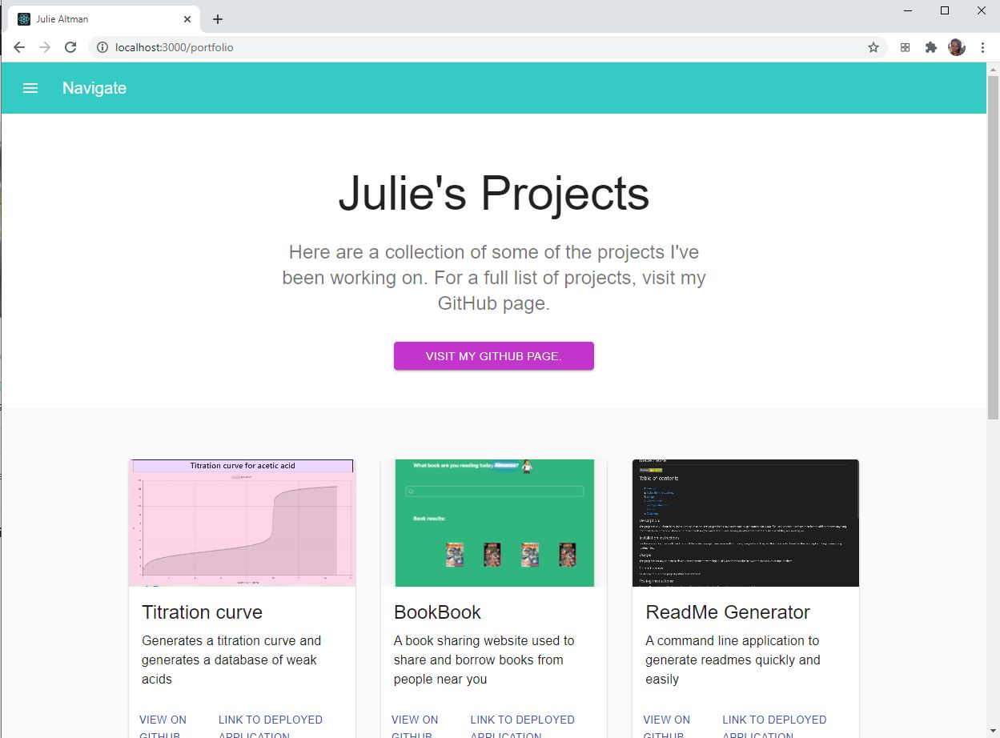

# skolportfolio 

# Table of contents
1. [Description](#Description)
2. [Installation instructions](#Installation-instructions)
3. [License](#License)
4. [Questions](#Questions)

## Description: 
This is a professional website and portfolio that also showcases use of React as well as the Material UI.

This application is deployed  <a href='https://skolnikportfolio.herokuapp.com/#/'>here.</a>

The user is greeted with the following screen:

The user can also view a portfolio of work:

## Installation instructions: 
This is a website, so just visit the link.

## License:  
This project is covered under the MIT License license.

## Questions
Visit my <a href='https://www.github.com/skolnikskolnik'>github page.</a> 

Email me at jtskolnik@gmail.com with any additional questions you may have. I am always happy to talk to users of my product!
    